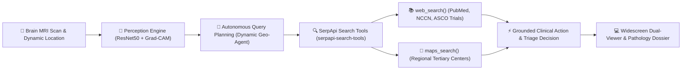

<div align="center">
  <h1>🧠 CerebrAI</h1>
  <p><b>Autonomous Neuro-Oncology Triage & Geospatial Referral Engine</b></p>
  <p>Empowering Primary Care Physicians with AI-Driven Diagnostics and Automated Inter-Facility Routing.</p>

  [](https://react.dev/)
  [](https://nextjs.org/)
  [](https://www.typescriptlang.org/)
  [](https://tailwindcss.com/)
  [](https://fastapi.tiangolo.com/)
  [](https://python.org/)
  [](https://keras.io/)
  [](https://serpapi.com/)

  <br />

  > **SerpApi Hackathon Entry** • **Track 01: AI Agents** • **Repository:** [`brain-tumour-agent`](https://github.com/moonylit/brain-tumour-agent)
</div>

---

## 🎯 Clinical Value Proposition (B2B)

*Not a self-diagnosis app.* CerebrAI is strictly a **physician-facing triage tool** designed for rural clinics, emergency departments, and primary care centers. It solves the critical "Door-to-Needle" delay by not just detecting intracranial anomalies on MRI, but instantly automating the referral pipeline to the nearest equipped specialized neurotrauma center.

* ⏱️ **Zero-Delay Referral:** Generates instant transfer contacts, bed routing, and telephone links for local tertiary neurosurgical units.
* 🛡️ **Physician Decision Support:** Pairs deep learning predictions with real-time PubMed standard-of-care guidelines and recruiting clinical trials.
* 🔍 **Transparent Explainability:** Overlays Gradient-weighted Class Activation Mapping (Grad-CAM) heatmaps with synchronized dual-viewer inspection.
* 📄 **Audit-Ready Documentation:** Exports co-branded, 2-page pathology-grade PDF dossiers with accession tracking and medical disclaimers.

---

## ⚙️ System Architecture & Data Pipeline

CerebrAI operates on a transparent, multi-stage computational workflow designed for clinical reliability.



### 🟢 Phase 1: Ingestion & Perception
* **Input:** 📍 Brain MRI Scan & Dynamic Location *(accepts WebP, JPEG, PNG, or any neuroimaging format up to 10MB)*
* **Perception Engine:** 🧠 (ResNet50 + Grad-CAM)
  > Deep neural network classification processing the scan to identify anomalies (*glioma, meningioma, pituitary, notumor*) powered by a fine-tuned ResNet-50 architecture. Explainability is enforced via Grad-CAM spatial heatmaps with dual asset generation (raw scan + salience heatmap overlay).

### 🟡 Phase 2: Autonomous Geo-Agent
* **Agent Trigger:** 🤖 Autonomous Query Planning
  > The Dynamic Geo-Agent activates upon tumor detection, utilizing the clinic's real-time geographic coordinates (via browser geolocation or manual physician selection).
* **Search Execution:** 🔍 SerpApi Search Tools (`serpapi-search-tools`)
  > The agent prepares parallel queries to fetch both authoritative oncology literature and regional geographic routing data.

### 🔵 Phase 3: Dual-Stream Data Fetching
The pipeline splits into two concurrent SerpApi functions:
1. 📚 **`web_search()`:** Scrapes authoritative clinical literature (PubMed, NCCN guidelines, ASCO clinical trials) for real-time treatment protocols and molecular biomarker criteria.
2. 🏥 **`maps_search()`:** Scans Google Maps for the nearest equipped *Regional Tertiary Centers* based on the dynamic location input, extracting verified facility addresses, direct telephone numbers, ratings, and directions.

### 🟣 Phase 4: Synthesis & UI Rendering
* **Decision Synthesis:** ⚡ Grounded Clinical Action & Triage Decision
  > Merges the AI classification, medical literature, and routing data into a single actionable protocol. Negative scans receive reassuring baseline criteria; tumor scans receive multi-modal escalation protocols.
* **Output:** 💻 Widescreen Dual-Viewer & Pathology-Grade Docs
  > Presents the physician with an enterprise-grade dashboard, displaying the MRI heatmap alongside automated transfer routing, interactive map overlays, and exportable 2-page PDF dossiers.

---

## 🤖 SerpApi Agent Capabilities

The Clinical Decision Agent (`backend/app/clinical_agent.py`) executes autonomous research tailored to diagnostic findings:

| Diagnostic State | Agent Strategy | Automated Output |
| :--- | :--- | :--- |
| **Negative / No Tumor (`notumor`)** | Baseline Neuro-Imaging Guidance | Reassuring non-escalation clinical notes, preventive lifestyle metrics, headache appropriateness criteria. |
| **Tumor Detected (`glioma`, `meningioma`, `pituitary`)** | Evidence Literature (`web_search`) | Current NCCN/EANO/Endocrine Society guidelines, surgical resection standards, active Phase II/III trial identifiers (`NCT`). |
| **Tumor Detected (`glioma`, `meningioma`, `pituitary`)** | Geospatial Discovery (`maps_search`) | Tertiary neuro-oncology hospitals, direct telephone contact, localized routing, verified Google ratings. |
| **Fail-Safe Resilience** | Dual-Tier Execution | Live SerpApi execution with automatic fallback to high-fidelity benchmarks, guaranteeing zero downtime in critical clinical care. |

---

## 🚀 Quickstart & Installation

### 1. Environment Configuration

Create a `.env` file in the project root or backend folder with your SerpApi key:

```bash
# SerpApi API Key (required for live web_search and maps_search execution)
SERPAPI_API_KEY=your_serpapi_api_key_here
```

### 2. Backend Setup (FastAPI & ML Engine)

Prerequisites: Python 3.10+ (Python 3.11 recommended).

```bash
# Navigate to backend
cd backend

# Activate virtual environment
# Windows:
..\.venv-gradcam\Scripts\activate
# Linux/macOS:
source ../.venv-gradcam/bin/activate

# Install requirements (including serpapi-search-tools & google-search-results)
pip install -r requirements.txt

# Start FastAPI server on port 8000
uvicorn app.main:app --host 127.0.0.1 --port 8000
```

> Interactive OpenAPI Swagger docs are live at `http://127.0.0.1:8000/docs`.

### 3. Frontend Setup (Next.js & React)

Prerequisites: Node.js 18+ and npm.

```bash
# Navigate to frontend
cd frontend

# Install dependencies
npm install

# Start development server
npm run dev
```

Open `http://localhost:3000` in your browser.

---

## 🧪 Testing & Verification

Both frontend and backend are covered with comprehensive test suites:

```bash
# Frontend Vitest Suite (96 passed tests across 12 test suites)
cd frontend
npm test

# Backend Pytest Suite (All endpoint, ML, and agent tests)
cd backend
pytest tests -v
```

---

## 📡 API Specification

### `POST /predict`
Uploads a brain MRI scan (WebP, JPG, PNG, etc.) and executes neural inference, Grad-CAM heatmap generation, and the SerpApi Clinical Agent.

* **Parameters:**
  * `file` *(multipart form)*: Axial Brain MRI file (up to 10MB).
  * `region` *(form data, optional)*: Geographic target city (default: `"Jaipur"`).
* **Sample Response:**
  ```json
  {
    "prediction": "meningioma",
    "confidence": 0.9856,
    "probabilities": {
      "glioma": 0.0084,
      "meningioma": 0.9856,
      "pituitary": 0.0040,
      "notumor": 0.0020
    },
    "processing_time_ms": 145.2,
    "heatmap_filename": "8ead867857914f239ab6dcc28bde9cfe.png",
    "raw_heatmap_filename": "raw_8ead867857914f239ab6dcc28bde9cfe.png",
    "accession_id": "ACC-20261010-EC8422",
    "region": "Jaipur",
    "agent_research": {
      "status": "escalation_recommended",
      "tumor_class": "Meningioma",
      "confidence": 0.9856,
      "region": "Jaipur",
      "escalation_required": true,
      "clinical_summary": "Presumptive Meningioma detected with 98.6% confidence. Multidisciplinary neurosurgical evaluation indicated.",
      "articles": [
        {
          "title": "EANO Guidelines on the Diagnosis and Treatment of Meningiomas",
          "snippet": "First-line management includes maximal safe surgical resection or stereotactic radiosurgery for high-risk lesions...",
          "url": "https://pubmed.ncbi.nlm.nih.gov/34327768/",
          "source": "PubMed / EANO"
        }
      ],
      "facilities": [
        {
          "name": "SMS Hospital & Institute of Medical Sciences (Department of Neurosurgery)",
          "rating": 4.6,
          "address": "JLN Marg, Ashok Nagar, Jaipur, Rajasthan 302004",
          "phone": "+91 141 251 8200",
          "link": "https://education.rajasthan.gov.in/smsmedicalcollege"
        }
      ],
      "queries_executed": [
        "Meningioma tumor standard of care guidelines PubMed",
        "Meningioma tumor novel therapeutics clinical trials",
        "tertiary neuro-oncology center hospital near Jaipur"
      ],
      "source_mode": "live_serpapi",
      "timestamp": "2026-10-10T13:10:40.315Z"
    }
  }
  ```

### `GET /report`
Generates a downloadable, audit-ready 2-page PDF clinical dossier with patient metadata, accession IDs, high-resolution Grad-CAM overlays, model validation metrics, and synthesized referral routing.

### `GET /history`
Retrieves past prediction records and agent telemetry with support for pagination, sorting, and tumor class filtering.

### `GET /statistics`
Returns aggregate throughput statistics, class distributions, and inference benchmarks.

### `GET /evaluation` & `GET /evaluation/plots`
Returns model validation metrics (Accuracy, Precision, Recall, F1) and precomputed ROC / Precision-Recall visualization curves.

---

## 🛠️ Enterprise Tech Stack

* **AI Agent & Intelligence:** `serpapi-search-tools` (`web_search`, `maps_search`), `google-search-results`
* **Perception & Explainability:** TensorFlow 2.15, Keras, Fine-Tuned ResNet-50, OpenCV, Grad-CAM (Heatmap + Alpha Masking)
* **Backend Services:** FastAPI, Uvicorn, Pydantic, ReportLab, Pytest
* **Frontend Architecture:** Next.js 16 (App Router), React 19, TypeScript, Tailwind CSS, Lucide Icons, Vitest, Testing Library
* **Clinical Workflow:** OpenStreetMap / Nominatim Dynamic Geocoding, Telephonic Routing, Pathology PDF Generation

---

<div align="center">
  <sub>Built for the SerpApi Hackathon • Track 01: AI Agents • Designed for Primary Care Physicians</sub>
</div>
