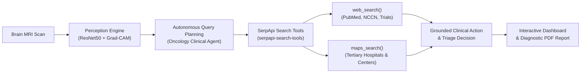

# Brain Tumour Agent: SerpApi Clinical Decision Support System

> **SerpApi Hackathon Entry**  
> **Track**: **Track 01 — AI Agents**  
> **Repository**: [`brain-tumour-agent`](https://github.com/moonylit/brain-tumour-agent)

An autonomous AI clinical agent bridging Computer Vision perception and real-world medical intelligence. The system pairs fine-tuned transfer learning neuroimaging classification with an autonomous **SerpApi Clinical Decision Support Agent** powered by `serpapi-search-tools` to retrieve peer-reviewed PubMed/NCCN standard-of-care guidelines, active clinical trials, and localized tertiary neuro-oncology surgical centers.

---

## System Architecture



### End-to-End Pipeline

1. **Perception Engine**:
   - Deep neural network classification (`glioma`, `meningioma`, `pituitary`, `notumor`) powered by fine-tuned ResNet50.
   - Explainability localization via Grad-CAM (Gradient-weighted Class Activation Mapping).
2. **Autonomous Query Planning**:
   - Analyzes detected class, confidence thresholds, and patient geographic region (default: Jaipur).
   - Generates targeted medical literature queries and regional healthcare discovery intents.
3. **SerpApi Search & Maps Tools**:
   - Built directly on **`serpapi-search-tools`**:
     * `web_search()`: Autonomously retrieves recent PubMed/NCCN standard-of-care guidelines and recruiting clinical trials.
     * `maps_search()`: Discovers and geolocates tertiary neuro-oncology hospitals and specialized surgical centers in/around the patient's city.
4. **Grounded Clinical Action**:
   - Triage assessment: Reassuring baseline neuro-imaging guidance for normal scans; comprehensive multi-modal escalation plan for detected tumors.
   - Structured JSON response, live UI panel alongside Grad-CAM visualization, and audit-ready PDF diagnostic report.

---

## SerpApi Agent Capabilities

The Clinical Decision Agent (`backend/app/clinical_agent.py`) executes autonomous research:

- **Negative / No Tumor Scans**:
  - Delivers reassuring baseline neuro-imaging findings without unnecessary specialty escalation.
  - Returns preventive neurological lifestyle and headache appropriateness criteria.
- **Tumor Detected (Glioma, Meningioma, Pituitary)**:
  - **Evidence-Based Literature (`web_search`)**:
    * Current NCCN / EANO / Endocrine Society clinical practice guidelines.
    * Molecular biomarker protocols (IDH1/2 mutations, 1p/19q co-deletions, skull base radiosurgery).
    * Active Phase II/III clinical trial identifiers (NCT registry links and trial abstracts).
  - **Regional Care Facilities (`maps_search`)**:
    * Tertiary cancer institutes and surgical neuro-oncology hospitals in the patient's region (default: Jaipur, India).
    * Hospital name, star ratings, full addresses, telephone contacts, and web portals.
  - **Resilience & Provenance**:
    * Integrates live SerpApi execution (`live_serpapi`) with robust fallback to high-fidelity clinical benchmarks if keys are missing or network is unavailable, ensuring zero downtime.

---

## Quickstart & Installation

### 1. Environment Configuration

Create a `.env` file in the project root or backend folder with your SerpApi key:

```bash
# SerpApi API Key (required for live web_search and maps_search execution)
SERPAPI_API_KEY=your_serpapi_api_key_here
```

### 2. Backend Setup

Prerequisites: Python 3.10+ (Python 3.11 recommended).

```bash
# Navigate to backend
cd backend

# Activate virtual environment
# Windows:
..\.venv-gradcam\Scripts\activate
# Linux/macOS:
source ../.venv-gradcam/bin/activate

# Install requirements (including serpapi-search-tools & google-search-results)
pip install -r requirements.txt

# Start FastAPI server on port 8000
uvicorn app.main:app --host 127.0.0.1 --port 8000 --reload
```

Interactive OpenAPI Swagger docs will be accessible at `http://127.0.0.1:8000/docs`.

### 3. Frontend Setup

Prerequisites: Node.js 18+ and npm.

```bash
# Navigate to frontend
cd frontend

# Install dependencies
npm install

# Start development dashboard
npm run dev
```

Open `http://localhost:3000` in your browser.

---

## Testing

Run automated unit and integration tests across both backend and frontend:

```bash
# Backend pytest suite (30 passed tests including clinical agent tests)
cd backend
pytest tests

# Frontend vitest suite (73 passed tests across 10 test suites)
cd frontend
npm test
```

---

## API Specification

### `POST /predict`
Uploads a brain MRI scan (JPG/PNG) and runs the perception model plus the autonomous SerpApi clinical agent.

- **Query Parameters**:
  - `patient_city` (*optional string*, default: `"Jaipur"`): Geographic region for hospital discovery.
- **Multipart Form Data**:
  - `file`: MRI image file.
- **Response**:
  ```json
  {
    "prediction": "glioma",
    "confidence": 0.9856,
    "probabilities": {
      "glioma": 0.9856,
      "meningioma": 0.0084,
      "pituitary": 0.004,
      "notumor": 0.002
    },
    "processing_time_ms": 145.2,
    "heatmap_filename": "d88a61aba45941ccb779a2a0352e660c.png",
    "agent_research": {
      "status": "escalation_recommended",
      "tumor_class": "Glioma",
      "confidence": 0.9856,
      "patient_city": "Jaipur",
      "escalation_required": true,
      "clinical_summary": "Presumptive Glioma detected with 98.6% confidence. Multidisciplinary surgical and radiation oncology evaluation indicated...",
      "articles": [
        {
          "title": "NCCN Clinical Practice Guidelines in Oncology: Central Nervous System Cancers (Glioma)",
          "snippet": "First-line standard of care involves maximal safe surgical resection followed by concurrent temozolomide chemoradiotherapy...",
          "url": "https://pubmed.ncbi.nlm.nih.gov/33227768/",
          "source": "NCCN / PubMed"
        }
      ],
      "facilities": [
        {
          "name": "Bhagwan Mahaveer Cancer Hospital & Research Centre (BMCHRC)",
          "rating": 4.7,
          "address": "Jawaharlal Nehru Marg, Bajaj Nagar, Jaipur, Rajasthan 302015",
          "phone": "+91 141 270 0107",
          "link": "https://www.bmchrc.org"
        }
      ],
      "queries_executed": [
        "Glioma standard of care NCCN guidelines PubMed",
        "Glioma novel therapeutics clinical trials",
        "tertiary neuro oncology cancer hospital surgical center Jaipur"
      ],
      "source_mode": "live_serpapi",
      "timestamp": "2026-10-04T12:00:00Z"
    }
  }
  ```

### `GET /report`
Downloads a PDF diagnostic report including patient info, Grad-CAM heatmap visualization, model validation benchmarks, and the **Evidence-Based Literature & Regional Oncology Centers** section synthesized by the SerpApi agent.

### `GET /history`
Retrieves past prediction records and agent telemetry with support for pagination, sorting, and tumor class filtering.

### `GET /statistics`
Returns aggregate statistics, class distribution, and average confidence scores.

### `GET /evaluation` & `GET /evaluation/plots`
Returns model validation metrics (Accuracy, Precision, Recall, F1) and precomputed ROC and Precision-Recall visualization curves.

---

## Tech Stack

- **AI Agent Framework**: `serpapi-search-tools` (`web_search`, `maps_search`), `google-search-results`
- **Deep Learning**: TensorFlow 2.15, Keras, ResNet50 Transfer Learning, Grad-CAM
- **Backend**: FastAPI, Uvicorn, Pydantic, ReportLab, Pytest
- **Frontend**: Next.js 16 (App Router), React 19, TypeScript, Tailwind CSS, Lucide Icons, Vitest
- **Tooling**: GitHub CLI (`gh`), Python venv
